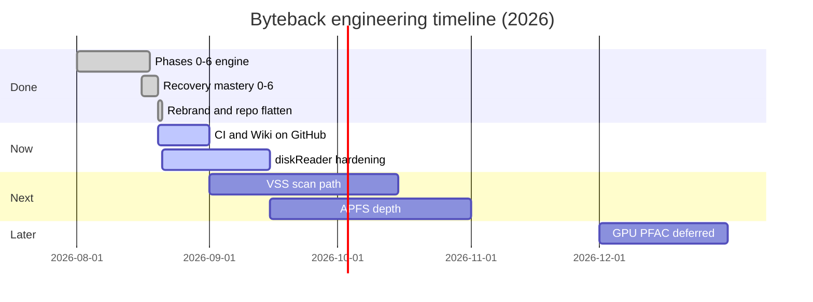

# Roadmap

**Status legend:** **Done** | **Now** | **Next** | **Later**

Sources: `README.md`, `docs/superpowers/plans/`, `.superpowers/sdd/2026-08-20-recovery-mastery/progress.md`, `docs/codebase-audit/2026-08-20-adversarial.md`. No fictional features.

## Now

| Item | Status | Notes |
|------|--------|-------|
| GitHub Actions CI on `main` | Now | Workflow exists locally; push requires `gh auth refresh -s workflow` |
| GitHub Wiki publish | Now | `wiki/` + `scripts/sync-wiki.sh` |
| Shared `diskReader_` hardening | Now | Audit AR20-004; serialize or split reader handles |

## Next

| Item | Status | Notes |
|------|--------|-------|
| VSS snapshot scan path | Next | Phase 2 plan; quick scan uses sentinel today |
| APFS full container walk | Next | Partial omap btree only; documented limit |
| 500 GB sparse deep-scan bench in CI | Next | README benchmark table — manual only |
| Issue triage from audit CONCERNS | Next | Track in GitHub Issues |

## Later

| Item | Status | Notes |
|------|--------|-------|
| GPU PFAC carving | Later | Explicitly deferred (Task 6.1, CPU-only constraint) |
| BitLocker TPM/password unlock | Later | Out of scope — FVEK/clear-key only |
| NIST 800-88 SSD sanitization | Later | PhysicalDrive wipe is DoD-style, not certified sanitization |

## Done (selected milestones)

| Item | Status | Notes |
|------|--------|-------|
| Phases 0–6 engine reliability | Done | NTFS depth, RAID, content search, Apple FS stubs, ops |
| Recovery mastery plan (Tasks 0–6) | Done | 249 native tests; see SDD progress ledger |
| Rebrand Wolf → Byteback | Done | Flat repo layout |
| Recover IPC DB-only | Done | AR20-002 closed |
| StopScan deadlock fix | Done | AR20-001 closed |
| Resident NTFS recovery | Done | AR20-003 closed |
| SSRF guard on HTTP images | Done | `test_http_url.cpp` |
| Playwright + recovery-flow e2e | Done | `e2e/` |
| Examiner Phase 7 surface | Done | Case/NSRL, scan profiles, preview panel |

## Timeline (approximate)

## Where to track work

- **Bugs / features:** https://github.com/batu3384/byteback/issues
- **Security:** [Security](Security.md) page + private advisory when enabled
- **Detailed plans:** `docs/superpowers/plans/` in the repository (not duplicated here)
